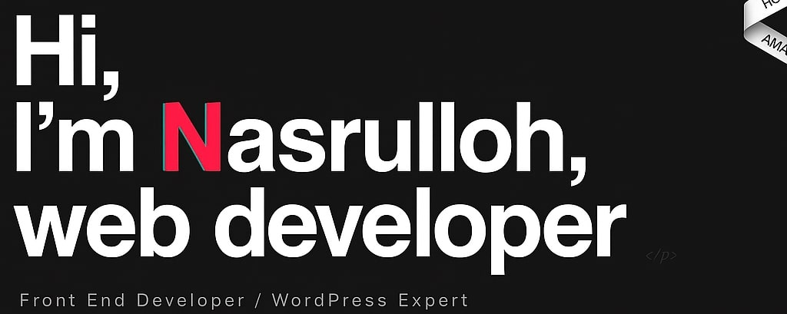

## Hello World! I'm Nasrulloh 👋
I'm a Junior Web Developer & Student at ARS University

🌱 **Currently Learning:**  
- Laravel Framework  
- Modern Web Development (HTML, CSS, JavaScript, PHP)

👯 **Open to Collaborate On:**  
- Web development projects  
- Laravel-based applications  
- UI/UX improvement and frontend integration  

🤔 **Looking for Help With:**  
- Optimizing Laravel backend structure  
- Clean architecture & best coding practices  

💬 **Ask Me About:**  
- Web development basics  
- Laravel fundamentals  
- Building simple CRUD apps  

📫 **How to Reach Me:**  
- Email: *(nasrulalfatih7@gmail.com)*  
- LinkedIn: *(https://www.linkedin.com/in/muhammad-nasrulloh-23b827373/)*  

⚡ **Fun Fact:**  
I enjoy experimenting with new tech stacks and learning something new every day!

---

## 🛠 Tech Stack
### Languages & Tools I Use
- PHP  
- Laravel  
- JavaScript  
- HTML & CSS  
- MySQL  
- Git & GitHub  

---

##  Projects I'm Working On
- Portfolio Website  
- Laravel CRUD Application  
- Data Science  

---

Thanks for visiting! 😄  
Feel free to explore my repositories.
